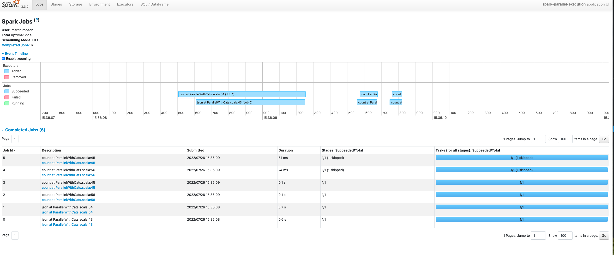

Spark Parallel Execution
===================================================

Experiments around executing spark queries in parallel.

Two methods are used here: -

* [ParallelWithFutures](src/main/scala/net/martinprobson/example/spark/ParallelWithFutures.scala) uses standard Scala Futures and callbacks.

* [ParallelWithCats](src/main/scala/net/martinprobson/example/spark/ParallelWithCats.scala) uses [Cats Effect](https://typelevel.org/cats-effect/) library to 
wrap the spark context in a [Resource](https://typelevel.org/cats-effect/docs/std/resource) and `parTraverseN` to control level of parallelism.

## ParallelWithCats
Note: Use method `closeSparkSessionWithPause` to keep the Spark UI active.

### Example Spark Job Output with parTraverseN(1)

### Example Spark Job Output with parTraverseN(10)

